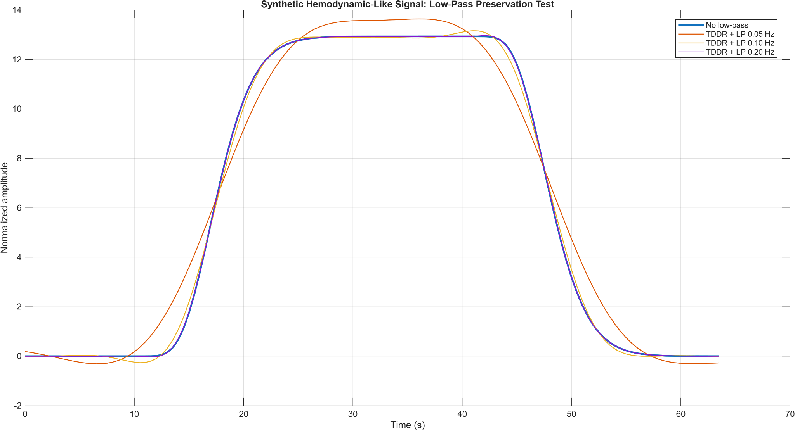
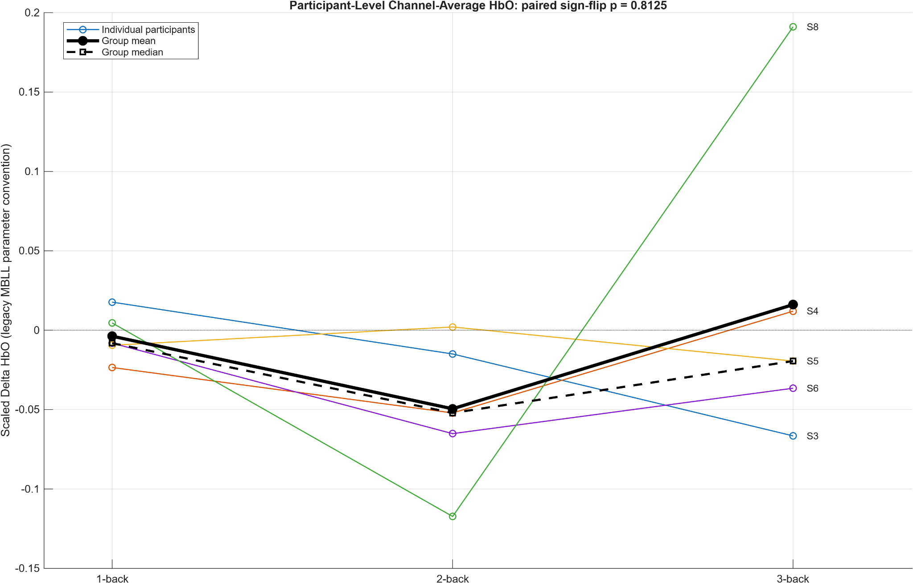
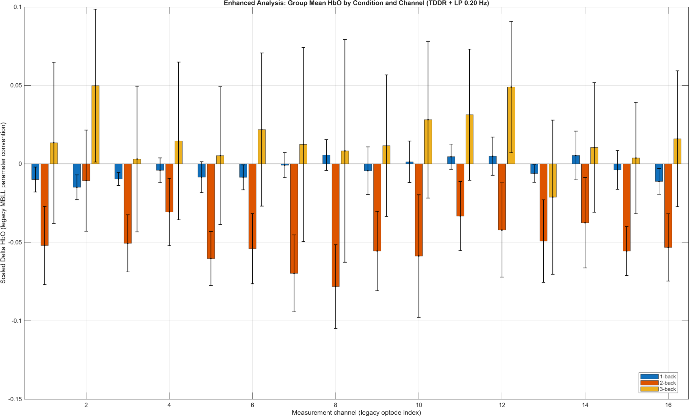
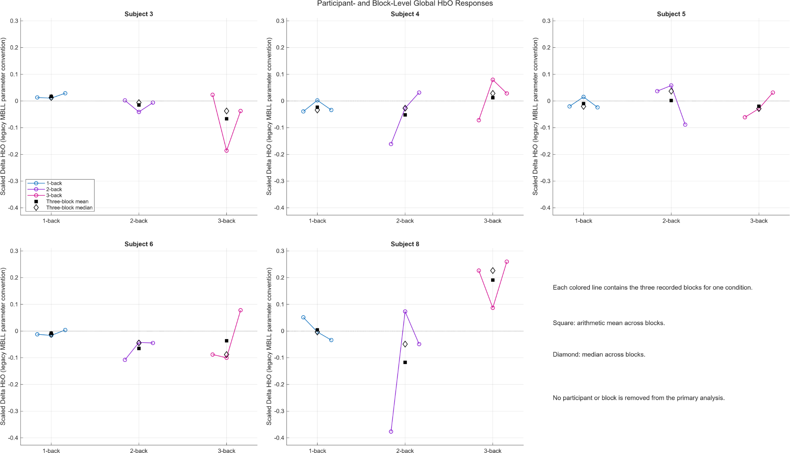
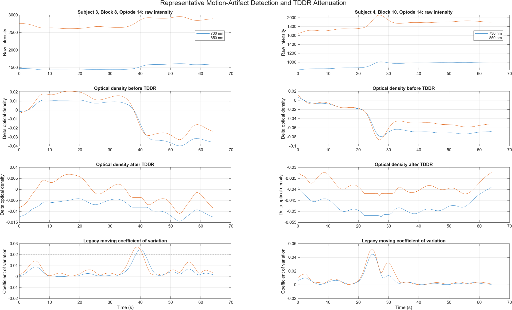

# Multi-Channel fNIRS Hemodynamic Analysis in MATLAB

This repository presents a MATLAB-based case study for processing multi-channel functional near-infrared spectroscopy (fNIRS) recordings from an n-back working-memory experiment.

The workflow converts raw optical-intensity recordings into scaled hemoglobin-response estimates, applies motion-artifact attenuation, performs quality-control checks, and compares 1-back, 2-back, and 3-back conditions at participant, block, channel, and group levels.

The project is framed as an **exploratory signal-processing and scientific-computing case study**, not as a validated neuroimaging study.

## At a glance

- **Input:** 45 anonymized fNIRS recordings from 5 participants.
- **Signals:** 16 measurement channels, each containing 730 nm, ambient, and 850 nm optical-intensity measurements.
- **Processing:** Optical-density conversion, TDDR-style motion-artifact attenuation, low-pass filtering, baseline re-centering, and MBLL-based scaled HbO/HbR estimation.
- **Validation checks:** Quality-control metrics, processing-sensitivity analysis, block-level consistency analysis, and leave-one-participant-out influence analysis.
- **Main result:** The enhanced exploratory analysis did **not** show a statistically reliable global HbO increase from 1-back to 3-back.

## Processing overview

```text
raw optical intensity
-> input validation
-> optical-density conversion
-> TDDR-style motion-artifact attenuation
-> 0.20 Hz zero-phase low-pass filtering
-> baseline re-centering
-> MBLL-based scaled HbO/HbR estimation
-> block-, participant-, channel-, and group-level summaries
-> exploratory statistics and sensitivity analyses
```

The primary engineering configuration is:

```text
TDDR-style attenuation + 0.20 Hz low-pass filter
```

The 0.20 Hz low-pass option was selected after comparing synthetic hemodynamic-signal preservation across no low-pass, 0.05 Hz, 0.10 Hz, and 0.20 Hz settings. The 0.20 Hz setting preserved the synthetic waveform with the lowest distortion among the tested low-pass configurations.



## What this project demonstrates

- Batch processing of 45 fNIRS recordings across 5 participants, 3 task conditions, and 3 repeated blocks per condition.
- Handling of 16 measurement channels, with 730 nm, ambient, and 850 nm optical-intensity signals per channel.
- Optical-density conversion from raw light intensity.
- TDDR-style temporal-derivative motion-artifact attenuation.
- Low-pass filtering with processing-sensitivity analysis.
- Modified Beer-Lambert Law (MBLL)-based scaled HbO/HbR estimation.
- Quality-control metrics for intensity validity, baseline variability, ambient-light ratio, and motion-candidate fraction.
- Participant-level paired comparisons and exploratory channel-level statistics.
- Block-level consistency checks and leave-one-participant-out influence analysis.

## Repository structure

```text
fnirs-hemodynamic-analysis/
|
|-- README.md
|-- TECHNICAL_REPORT.md
|-- CITATION.cff
|-- CITATION.md
|-- LICENSE
|-- .gitignore
|
|-- src/
|   `-- RenanArdaCarlak_fNIRS_Enhanced_v4.m
|
|-- legacy/
|   `-- RenanArdaCarlak_fNIRS_original.m
|
|-- data/
|   |-- README.md
|   `-- raw/
|       `-- Subject_*_lightgraph*.txt
|
|-- results/
|   |-- csv/
|   `-- figures/
|
`-- docs/
    `-- method_notes.md
```

## Data organization

The raw input files contain 48 columns:

```text
16 channels x [730 nm, ambient, 850 nm] = 48 columns
```

The analyzed dataset contains:

| Item | Count |
|---|---:|
| Participants | 5 |
| Conditions | 3 |
| Repeated blocks per condition | 3 |
| Total recordings | 45 |
| Measurement channels | 16 |
| Columns per recording | 48 |
| Sampling frequency | 2 Hz |

The repository includes the anonymized raw subject recordings under:

```text
data/raw/
```

The subject numbers `3`, `4`, `5`, `6`, and `8` are anonymized dataset labels. They do not encode participant identity. No personal identifiers, demographic variables, behavioral scores, or acquisition metadata identifying individual participants are included. See `data/README.md` for the file naming pattern and design layout.

## Main result

The enhanced analysis does **not** support a statistically reliable global HbO increase from 1-back to 3-back in this small dataset.

| Metric | Value |
|---|---:|
| Mean 3-back minus 1-back | 0.0199 |
| Cohen's dz | 0.194 |
| 95% bootstrap interval | -0.0491 to 0.1079 |
| Exact paired sign-flip p | 0.8125 |
| Repeated-measures omnibus p | 0.4514 |
| FDR-significant channels | 0 / 16 |

The direction of the global 3-back minus 1-back effect changes when Subject 8 is omitted. This indicates that the apparent positive group-level trend is sensitive to one participant and should not be interpreted as a reliable workload-dependent HbO increase.



## Representative outputs

### Channel-level exploratory HbO estimates

The channel-wise group plot summarizes scaled HbO estimates for 1-back, 2-back, and 3-back conditions across the 16 measurement channels. It is useful as a high-level overview of condition-dependent patterns, but it is not sufficient by itself to support an inferential claim.



### Block-level consistency

The block-level analysis shows that repeated blocks are not uniformly stable across participants and conditions. This explains why the group-level condition means should be treated as exploratory.



Mean- and median-based aggregation across the three blocks produced the same paired sign-flip p-value for the 3-back minus 1-back comparison:

```text
p_mean   = 0.8125
p_median = 0.8125
```

This suggests that the main interpretation is not simply an artifact of using arithmetic means across repeated blocks.

### Motion-artifact diagnostics

The legacy moving coefficient-of-variation metric was retained as a motion-candidate detector. Representative cases from Subject 3 and Subject 4 show clear candidate artifact periods and the effect of TDDR-style attenuation on optical-density signals.



## Important limitations

This repository should be interpreted as an engineering and scientific-computing case study. The following limitations remain:

- Only 5 participants are available.
- There are no short-separation channels for systemic-signal regression.
- There are no anatomical channel coordinates for spatial localization.
- There is no accelerometer or motion ground truth for independent artifact validation.
- Behavioral accuracy and reaction-time data are not included.
- MBLL constants and the DPF value are preserved from the legacy implementation but still require source and unit-chain documentation before reporting absolute concentration units.
- Results are therefore reported as scaled HbO/HbR values under the legacy MBLL parameter convention.

## How to run

1. Clone or download the repository.
2. Keep the anonymized raw text files under `data/raw/`.
3. Open MATLAB from the repository root and run:

```matlab
clear;
clc;
close all;
addpath('src');
RenanArdaCarlak_fNIRS_Enhanced_v4
```

The script also searches the working directory, `data/`, and `data/raw/` for the expected input files.

The script writes outputs to:

```text
results_enhanced_v4/
```

The repository version stores selected outputs under:

```text
results/csv/
results/figures/
```

## Selected outputs

| Output | Description |
|---|---|
| `group_condition_summary.csv` | Group-level HbO summaries by condition |
| `global_statistics.csv` | Global paired and omnibus statistics |
| `subject_level_hbo_results.csv` | Subject-condition-channel summaries |
| `block_level_hbo_results.csv` | Block-level global HbO values |
| `block_aggregation_sensitivity.csv` | Mean vs median block aggregation comparison |
| `leave_one_participant_out.csv` | Influence analysis by omitted participant |
| `exploratory_channel_statistics.csv` | Per-channel exploratory statistics and FDR adjustment |
| `quality_control_metrics.csv` | Channel-level QC diagnostics |
| `filter_preservation_test.csv` | Synthetic signal preservation metrics for filter options |
| `mbll_parameter_audit.csv` | MBLL parameter audit table |

## Citation

Please cite this repository using the metadata provided in `CITATION.cff`.

**Plain-text citation:**

```text
Carlak, R. A. (2026). Multi-Channel fNIRS Hemodynamic Analysis in MATLAB (Version 1.0.0) [Computer software]. GitHub. https://github.com/RenanArdaCarlak/fnirs-hemodynamic-analysis
```

**BibTeX:**

```bibtex
@software{carlak_fnirs_hemodynamic_analysis_2026,
  author  = {Carlak, Renan Arda},
  title   = {Multi-Channel fNIRS Hemodynamic Analysis in MATLAB},
  year    = {2026},
  version = {1.0.0},
  url     = {https://github.com/RenanArdaCarlak/fnirs-hemodynamic-analysis}
}
```

## Portfolio description

```text
Developed a MATLAB-based fNIRS signal-processing pipeline for multi-channel optical recordings, including optical-density conversion, TDDR-style motion-artifact attenuation, MBLL-based HbO/HbR estimation, quality-control metrics, and exploratory within-subject analysis of n-back working-memory conditions.
```

## License

This repository is provided as a source-available portfolio project. Viewing and local inspection are allowed. Reproduction, redistribution, derivative use, or reuse in another project requires explicit written permission from the author. See `LICENSE`.
